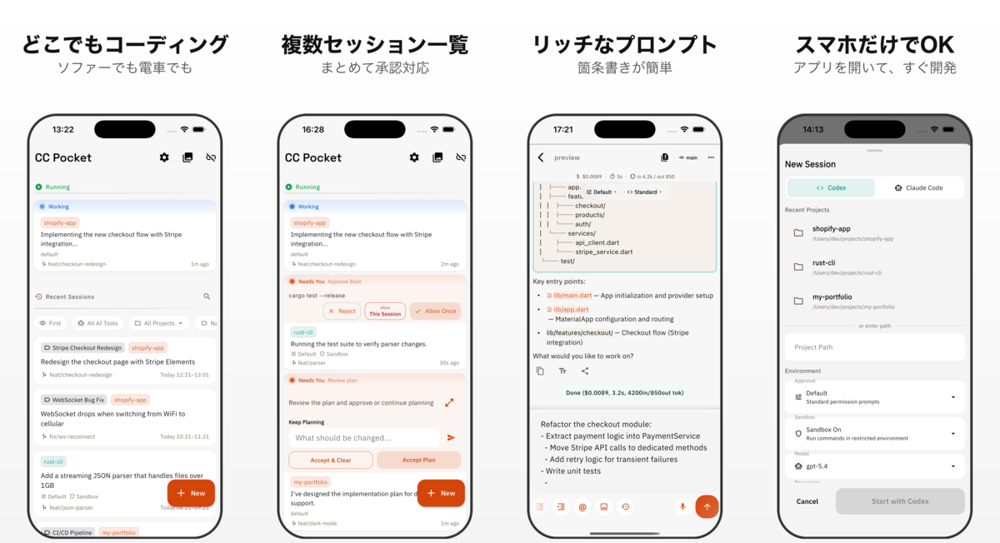

# CC Pocket

CC Pocket は、Claude Code / Codex を自分のMacで動かしながら、スマホから操作・確認できるアプリです。進捗確認、質問への回答、ツール承認、差分レビューを外出先からでも行えます。

[English README](README.md)

<p align="center">
  
</p>

CC Pocket は Anthropic / OpenAI とは無関係であり、承認・提携・公式提供を受けたものではありません。

## こんな人向け

CC Pocket は、すでにコーディングエージェントを実用的に使っていて、席を離れている間もセッションを追いたい人向けのアプリです。

- **長時間のエージェント実行を回す個人開発者**
- **移動中や外出中でも開発を止めたくないインディーハッカーや創業者**
- **複数セッションと承認依頼を捌きたい AI ネイティブな開発者**
- **コードをホスト型 IDE ではなく自分のマシンに置いておきたいセルフホスター**

「エージェントを走らせて、必要なときだけ介入したい」という使い方に向いています。

## 何が便利か

- **スマホからセッション開始・再開** ができる
- **承認依頼を素早く処理** できる
- **ストリーミング出力をリアルタイムで確認** できる
- **シンタックスハイライト付きで差分レビュー** できる
- **Markdown や画像添付で質の高いプロンプト** を送れる
- **複数セッションをプロジェクト単位で整理** できる
- **承認待ちや完了をプッシュ通知** で受け取れる
- **保存済みマシン、QR、mDNS、手入力** で接続できる
- **launchd + SSH でリモートの Mac を管理** できる

## CC Pocket でできること / できないこと

期待値のズレを防ぐため、ここは明確にしておきます。

| 項目 | 対応 |
|------|------|
| CC Pocket から新規の Claude Code / Codex セッションを開始する | `できる` |
| 自分の Mac に保存されているセッション履歴から過去のセッションを復元して再開する | `できる` |
| Mac 上で直接開始されたアクティブなセッションに、途中から CC Pocket がライブ接続してそのまま引き継ぐ | `できない` |

Mac 側で CC Pocket を介さずに開始したセッションでも、履歴として保存された後に再開することはできます。ただし、その時点で進行中のライブセッションに途中参加することはできません。

## 仕組み

1. Claude Code または Codex CLI が入ったマシンで Bridge Server を起動します。
2. モバイルアプリからその Bridge Server に接続します。
3. スマホからセッション開始、質問への回答、ツール承認、差分レビューを行います。

コーディングセッション自体は、あなた自身のマシン上で、あなた自身の Bridge Server を通じて動きます。

## クイックスタート

### 1. CLI を用意

ホストマシンに以下のいずれかをインストールしてください。

- [Claude Code CLI](https://docs.anthropic.com/en/docs/claude-code)
- [Codex CLI](https://github.com/openai/codex)

加えて [Node.js](https://nodejs.org/) 18 以上が必要です。

### 2. Bridge Server を起動

```bash
# npx でそのまま実行
npx @ccpocket/bridge@latest

# またはグローバルインストール
npm install -g @ccpocket/bridge
ccpocket-bridge
```

デフォルトでは `ws://0.0.0.0:8765` で待ち受け、アプリで読み取れる QR コードがターミナルに表示されます。

任意でヘルスチェックも実行できます。

```bash
npx @ccpocket/bridge@latest doctor
# または
ccpocket-bridge doctor
```

### 3. アプリをインストール

<div align="center">
<a href="https://apps.apple.com/us/app/cc-pocket-dev-agent-remote/id6759188790"></a>&nbsp;&nbsp;&nbsp;&nbsp;&nbsp;<a href="https://play.google.com/store/apps/details?id=com.k9i.ccpocket"></a>
</div>

### 4. 接続

| 方法 | 向いているケース |
|------|------------------|
| **保存済みマシン** | 普段使い、再接続、状態確認、お気に入り管理 |
| **QRコード** | 初回セットアップを最短で済ませたいとき |
| **mDNS自動発見** | 同一ネットワーク上で IP 入力を避けたいとき |
| **手動入力** | Tailscale、リモート環境、カスタムポート |

例:

- `ws://192.168.1.5:8765`
- `ws://100.x.y.z:8765` over Tailscale
- `ccpocket://connect?url=ws://IP:PORT&token=API_KEY`

### 5. セッションを開始

アプリでプロジェクトと permission mode を選び、Claude Code または Codex のセッションを開始します。

| Permission Mode | 挙動 |
|----------------|------|
| `Default` | 標準の対話モード |
| `Accept Edits` | ファイル編集は自動承認し、それ以外は確認 |
| `Plan` | 実行前にプラン承認を挟む |
| `Bypass All` | すべて自動承認 |

必要なら **Worktree** を有効にして、セッションごとに独立した git worktree を使えます。

## プロジェクト設定 (`.ccpocket.toml`)

プロジェクトルートに `.ccpocket.toml` を配置すると、Bridge Server の worktree やサンドボックスの動作をプロジェクトごとに設定できます。

ユーザー共通のデフォルトとして `~/.ccpocket.toml` も利用可能です。プロジェクトレベルの設定がグローバル設定より優先されます。

### Worktree

セッション開始時に **Worktree** を有効にすると、[git worktree](https://git-scm.com/docs/git-worktree) で独立したブランチ・ディレクトリが自動的に作成されます。同じプロジェクトで複数のセッションを競合なく並行して実行できます。

`[worktree]` セクションでファイルコピーとライフサイクルフックを設定します:

| セクション | キー | 説明 |
|-----------|------|------|
| `[worktree.copy]` | `include` | コピーするファイルの glob パターン（`.env` や設定ファイル等） |
| `[worktree.copy]` | `exclude` | コピーから除外する glob パターン |
| `[worktree.copy]` | `includeDirs` | 再帰的にコピーするディレクトリ名 |
| `[worktree.copy]` | `excludeDirs` | 除外するディレクトリ名 |
| `[worktree.hooks]` | `postCreate` | worktree 作成後に実行するシェルコマンド |
| `[worktree.hooks]` | `preRemove` | worktree 削除前に実行するシェルコマンド |

**Tips:** `.claude/settings.local.json` を `include` に含めるのが特におすすめです。MCP サーバー設定やパーミッション設定が各 worktree セッションに自動的に引き継がれます。

### Sandbox (Claude Code)

`[sandbox]` セクションでは、アプリからサンドボックスモードを有効にした際の Claude Code の OS レベルサンドボックス動作を設定します。

| セクション | キー | 説明 |
|-----------|------|------|
| `[sandbox]` | `autoAllowBash` | サンドボックス内の bash コマンドを自動承認（デフォルト: `true`） |
| `[sandbox]` | `allowUnsandboxedCommands` | 特定コマンドをサンドボックス外で実行許可（デフォルト: `false`） |
| `[sandbox.network]` | `allowLocalBinding` | ローカルポートへのバインドを許可 |
| `[sandbox.network]` | `allowedDomains` | 許可するネットワークドメインのリスト |
| `[sandbox.network]` | `allowUnixSockets` | 許可する Unix ソケットパスのリスト |
| `[sandbox.network]` | `allowAllUnixSockets` | すべての Unix ソケット接続を許可 |
| `[sandbox.filesystem]` | `allowWrite` | 書き込みを許可する追加パス |
| `[sandbox.filesystem]` | `denyWrite` | 書き込みを拒否するパス |
| `[sandbox.filesystem]` | `denyRead` | 読み取りを拒否するパス |

<details>
<summary><code>.ccpocket.toml</code> の設定例</summary>

```toml
[worktree.copy]
# Claude Code の設定（MCP サーバー、パーミッション、追加ディレクトリ）
include = [".claude/settings.local.json"]

# 環境固有の設定
# include = ["apps/mobile/android/local.properties"]

# node_modules をコピーして worktree 構築を高速化
includeDirs = ["node_modules"]

[worktree.hooks]
# worktree 作成後に Flutter の依存関係を復元
postCreate = "cd apps/mobile && flutter pub get"

[sandbox]
autoAllowBash = true

[sandbox.network]
# 開発サーバーがローカルポートにバインドできるようにする
allowLocalBinding = true
```

</details>

### `.gtrconfig` との互換性

プロジェクトに [git-worktree-runner](https://github.com/coderabbitai/git-worktree-runner) の [`.gtrconfig`](https://github.com/coderabbitai/git-worktree-runner?tab=readme-ov-file#team-configuration-gtrconfig) がすでにある場合、Bridge Server は worktree 設定としてそのまま読み込みます。両方のファイルが存在する場合は `.ccpocket.toml` が優先されます。

## 典型的な使い方

- **常時稼働の Mac mini** 上でエージェントを動かし、スマホから様子を見る
- **移動中の軽いレビュー運用** として、必要なときだけ返答や承認をする
- **複数プロジェクトの並列セッション** をスマホ側でまとめて追う
- **Tailscale 経由の個人インフラ** で外出先から安全に接続する

## リモートアクセスとマシン管理

### Tailscale

外出先から Bridge Server に繋ぐなら、Tailscale が最も手軽です。

1. ホストマシンとスマホの両方に [Tailscale](https://tailscale.com/) を入れる
2. 同じ tailnet に参加する
3. アプリから `ws://<host-tailscale-ip>:8765` に接続する

### 保存済みマシンと SSH

アプリには、host / port / API key / 任意の SSH 認証情報を持つマシンを登録できます。

SSH を有効にすると、マシンカードから以下の操作ができます。

- `Start`
- `Stop Server`
- `Update Bridge`

この運用は **launchd を使う macOS ホスト** を前提にしています。

### macOS の launchd セットアップ

Bridge Server を管理しやすいバックグラウンドサービスとして扱いたい場合は、組み込みの setup コマンドを使います。

```bash
npx @ccpocket/bridge@latest setup
npx @ccpocket/bridge@latest setup --port 9000 --api-key YOUR_KEY
npx @ccpocket/bridge@latest setup --uninstall

# グローバルインストール時
ccpocket-bridge setup
```

## プラットフォーム補足

- **Bridge Server**: Node.js と CLI provider が動く環境なら利用可能
- **アプリからの SSH start/stop/update**: `launchd` 設定済みの macOS ホスト向け
- **ウィンドウ一覧とスクリーンショット取得**: macOS ホスト専用
- **Tailscale**: 必須ではないが、リモート接続には強く推奨

常時稼働マシンとしては、現状では Mac mini が最も相性の良い構成です。

## スクリーンショット機能のためのホスト設定

macOS でスクリーンショット機能を使う場合は、Bridge Server を起動するターミナルアプリに **画面収録** 権限を付与してください。

権限がないと、`screencapture` が黒い画像を返すことがあります。

場所:

`システム設定 -> プライバシーとセキュリティ -> 画面収録`

常時稼働ホストで安定してウィンドウキャプチャを使うなら、ディスプレイのスリープと自動ロックも無効化しておくのがおすすめです。

```bash
sudo pmset -a displaysleep 0 sleep 0
```

## 開発

### リポジトリ構成

```text
ccpocket/
├── packages/bridge/    # Bridge Server (TypeScript, WebSocket)
├── apps/mobile/        # Flutter mobile app
└── package.json        # npm workspaces root
```

### ソースからビルド

```bash
git clone https://github.com/K9i-0/ccpocket.git
cd ccpocket
npm install
cd apps/mobile && flutter pub get && cd ../..
```

### よく使うコマンド

| コマンド | 説明 |
|---------|------|
| `npm run bridge` | Bridge Server を開発モードで起動 |
| `npm run bridge:build` | Bridge Server をビルド |
| `npm run dev` | Bridge を再起動し、Flutter アプリも起動 |
| `npm run dev -- <device-id>` | デバイス指定付きで同上 |
| `npm run setup` | Bridge Server を launchd サービスとして登録 |
| `npm run test:bridge` | Bridge Server のテスト実行 |
| `cd apps/mobile && flutter test` | Flutter テスト実行 |
| `cd apps/mobile && dart analyze` | Dart 静的解析 |

### 環境変数

| 変数 | デフォルト | 説明 |
|------|-----------|------|
| `BRIDGE_PORT` | `8765` | WebSocket ポート |
| `BRIDGE_HOST` | `0.0.0.0` | バインドアドレス |
| `BRIDGE_API_KEY` | 未設定 | API key 認証を有効化 |
| `BRIDGE_ALLOWED_DIRS` | `$HOME` | 許可するプロジェクトディレクトリ。カンマ区切り |
| `DIFF_IMAGE_AUTO_DISPLAY_KB` | `1024` | 画像 diff の自動表示しきい値 |
| `DIFF_IMAGE_MAX_SIZE_MB` | `5` | 画像 diff プレビューの最大サイズ |

## ライセンス

[MIT](LICENSE)
