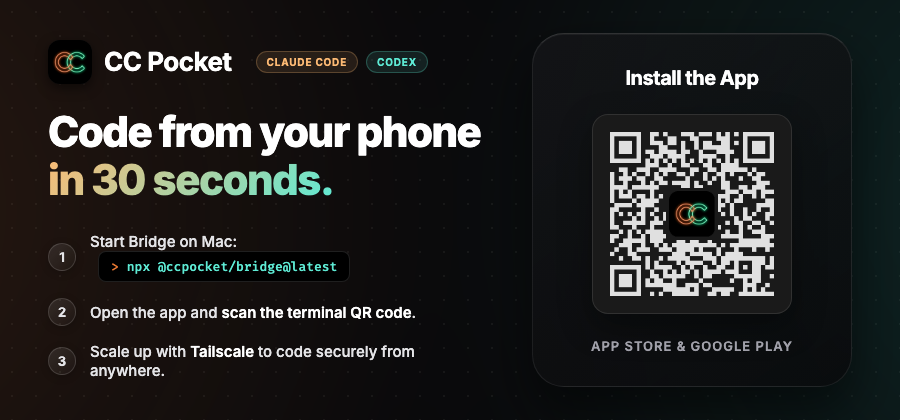

# CC Pocket

CC Pocket lets you start and run Claude Code and Codex sessions entirely from your phone. No laptop needed — just open the app, pick a project, and code from anywhere.

[日本語版 README](README.ja.md)

<p align="center">
  
</p>

CC Pocket is not affiliated with, endorsed by, or associated with Anthropic or OpenAI.

## Why CC Pocket?

AI coding agents are getting autonomous enough to write entire features on their own. Your role shifts from writing code to making decisions — approve this tool, answer that question, review the diff.

Decisions don't need a keyboard. They need a screen and a thumb.

CC Pocket is built for this workflow: start a session from your phone, let your machine's Claude Code or Codex do the heavy lifting, and make decisions from wherever you are.

## Who It's For

CC Pocket is for people who already rely on coding agents and want an easier way to stay in the loop when they are away from the keyboard.

- **Solo developers running long agent sessions** on a Mac mini, Raspberry Pi, Linux server, or laptop
- **Indie hackers and founders** who want to keep shipping while commuting, walking, or away from their desk
- **AI-native engineers** juggling multiple sessions and frequent approval requests
- **Self-hosters** who want their code to stay on their own machine instead of a hosted IDE

If your workflow is "start an agent, let it run, step in only when needed," CC Pocket is built for that.

## Why People Use It

- **Start or resume sessions from your phone** once your Bridge Server is reachable
- **Handle approvals quickly** with a touch-first UI instead of a terminal prompt
- **Watch streaming output live** including plans, tool activity, and agent responses
- **Review diffs more easily** with syntax-highlighted code changes and image diff support
- **Write better prompts** with Markdown, auto-completing bullet lists, and image attachments
- **Track multiple sessions** with project grouping, search, and approval badges
- **Get notified when action is needed** with push notifications for approvals and task completion
- **Connect however you prefer** with saved machines, QR codes, mDNS discovery, or manual URLs
- **Manage a remote host over SSH** for start, stop, and update flows

## CC Pocket vs Remote Control

Claude Code's built-in Remote Control hands off an existing terminal session to your phone — you start on your Mac and continue from mobile.

CC Pocket takes a different approach: **sessions start on your phone and run to completion there.** Your Mac works in the background; your phone is the primary interface.

| | Remote Control | CC Pocket |
|---|---------------|-----------|
| Session origin | Start on Mac, hand off to phone | Start on phone |
| Primary device | Mac (phone joins later) | Phone (Mac runs in background) |
| Use case | Continue a desktop task on the go | Start coding from anywhere |
| Setup | Built into Claude Code | Self-hosted Bridge Server |

**What this means in practice:**
- You **can** start a brand-new session and run it entirely from your phone
- You **can** reopen past sessions from history stored on your Mac
- You **cannot** attach to a live session that was started directly on your Mac

## Getting Started

<p align="center">
  
</p>

### 1. Start the Bridge Server

Install [Node.js](https://nodejs.org/) 18+ and at least one CLI provider ([Claude Code](https://docs.anthropic.com/en/docs/claude-code) or [Codex](https://github.com/openai/codex)) on your host machine, then run:

```bash
npx @ccpocket/bridge@latest
```

The server prints a QR code you can scan from the app to connect instantly.

### 2. Install the Mobile App

Scan the QR code in the banner above, or download directly:

<div align="center">
<a href="https://apps.apple.com/us/app/cc-pocket-dev-agent-remote/id6759188790"></a>&nbsp;&nbsp;&nbsp;&nbsp;&nbsp;<a href="https://play.google.com/store/apps/details?id=com.k9i.ccpocket"></a>
</div>

### macOS Desktop (Beta)

A macOS native app is also available. It started as an experiment — some users liked the mobile-first UI so much that they asked for the same experience on their Mac.

It's still in beta, but fully functional. Download the latest `.dmg` from [GitHub Releases](https://github.com/K9i-0/ccpocket/releases?q=macos) (look for releases tagged `macos/v*`).

### 3. Connect and Start Coding

| Connection Method | Best for |
|-------------------|----------|
| **QR Code** | Fastest first-time setup — scan the terminal QR |
| **Saved Machines** | Regular use with reconnects and status checks |
| **mDNS Auto-Discovery** | Same-network discovery without typing IPs |
| **Manual Input** | Tailscale, remote hosts, or custom ports |

In the app, choose a project and permission mode, then start a session.

| Permission Mode | Behavior |
|----------------|----------|
| `Default` | Standard interactive mode |
| `Accept Edits` | Auto-approve file edits, ask for everything else |
| `Plan` | Stay in planning mode until you approve execution |
| `Bypass All` | Auto-approve everything |

You can also enable **Worktree** to isolate a session in its own git worktree.

## Worktree Configuration (`.gtrconfig`)

When starting a session, you can enable **Worktree** to automatically create a [git worktree](https://git-scm.com/docs/git-worktree) with its own branch and directory. This lets you run multiple sessions in parallel on the same project without conflicts.

Place a [`.gtrconfig`](https://github.com/coderabbitai/git-worktree-runner?tab=readme-ov-file#team-configuration-gtrconfig) file in your project root to configure file copying and lifecycle hooks:

| Section | Key | Description |
|---------|-----|-------------|
| `[copy]` | `include` | Glob patterns for files to copy (e.g. `.env`, config files) |
| `[copy]` | `exclude` | Glob patterns to exclude from copy |
| `[copy]` | `includeDirs` | Directory names to copy recursively |
| `[copy]` | `excludeDirs` | Directory names to exclude |
| `[hook]` | `postCreate` | Shell command(s) to run after worktree creation |
| `[hook]` | `preRemove` | Shell command(s) to run before worktree deletion |

**Tip:** Adding `.claude/settings.local.json` to the `include` list is especially recommended. This carries over your MCP server configuration and permission settings to each worktree session automatically.

<details>
<summary>Example <code>.gtrconfig</code></summary>

```ini
[copy]
# Claude Code settings (MCP servers, permissions, additional directories)
include = .claude/settings.local.json

# Speed up worktree setup by copying node_modules
includeDirs = node_modules

[hook]
# Restore Flutter dependencies after worktree creation
postCreate = cd apps/mobile && flutter pub get
```

</details>

## Sandbox Configuration (Claude Code)

When sandbox mode is enabled from the app, Claude Code uses its native `.claude/settings.json` (or `.claude/settings.local.json`) for detailed sandbox configuration. No Bridge-side config is needed.

See the [Claude Code documentation](https://docs.anthropic.com/en/docs/claude-code) for the full `sandbox` schema.

## Ideal Use Cases

- **An always-on host** (Mac mini, Raspberry Pi, Linux server) running the agent while you monitor from your phone
- **A lightweight review loop on the go** where the agent codes and you approve commands or answer questions as needed
- **Parallel sessions across projects** with one mobile inbox for pending approvals
- **Remote personal infrastructure** over Tailscale instead of exposing ports publicly

## Remote Access and Machine Management

### Tailscale

Tailscale is the easiest way to reach your Bridge Server outside your home or office network.

1. Install [Tailscale](https://tailscale.com/) on your host machine and phone.
2. Join the same tailnet.
3. Connect to `ws://<host-tailscale-ip>:8765` from the app.

### Saved Machines and SSH

You can register machines in the app with host, port, API key, and optional SSH credentials.

When SSH is enabled, CC Pocket can trigger these remote actions from the machine card:

- `Start`
- `Stop Server`
- `Update Bridge`

This flow supports **macOS (launchd)** and **Linux (systemd)** hosts.

### Service Setup

The `setup` command automatically detects your OS and registers the Bridge Server as a managed background service.

```bash
npx @ccpocket/bridge@latest setup
npx @ccpocket/bridge@latest setup --port 9000 --api-key YOUR_KEY
npx @ccpocket/bridge@latest setup --uninstall

# global install variant
ccpocket-bridge setup
```

#### macOS (launchd)

On macOS, `setup` creates a launchd plist and registers it with `launchctl`. The service starts via `zsh -li -c` to inherit your shell environment (nvm, pyenv, Homebrew, etc.).

#### Linux (systemd)

On Linux, `setup` creates a systemd user service. It resolves the full path to `npx` at setup time so that nvm/mise/volta-managed Node.js works correctly under systemd.

> **Tip:** Run `loginctl enable-linger $USER` to keep the service running after logout.

## Platform Notes

- **Bridge Server**: works anywhere Node.js and your CLI provider work
- **Service setup**: macOS (launchd) and Linux (systemd)
- **SSH start/stop/update from the app**: macOS (launchd) or Linux (systemd) host
- **Window listing and screenshot capture**: macOS-only host feature
- **Tailscale**: optional, but strongly recommended for remote access

If you want a clean always-on setup, a Mac mini or a headless Linux box is the best-supported host environment right now.

## Host Configuration for Screenshot Capture

If you want to use screenshot capture on macOS, grant **Screen Recording** permission to the terminal app that runs the Bridge Server.

Without it, `screencapture` can return black images.

Path:

`System Settings -> Privacy & Security -> Screen Recording`

For reliable window capture on an always-on host, it also helps to disable display sleep and auto-lock.

```bash
sudo pmset -a displaysleep 0 sleep 0
```

## Development

### Repository Layout

```text
ccpocket/
├── packages/bridge/    # Bridge Server (TypeScript, WebSocket)
├── apps/mobile/        # Flutter mobile app
└── package.json        # npm workspaces root
```

### Build From Source

```bash
git clone https://github.com/K9i-0/ccpocket.git
cd ccpocket
npm install
cd apps/mobile && flutter pub get && cd ../..
```

### Common Commands

| Command | Description |
|---------|-------------|
| `npm run bridge` | Start Bridge Server in dev mode |
| `npm run bridge:build` | Build the Bridge Server |
| `npm run dev` | Restart Bridge and launch the Flutter app |
| `npm run dev -- <device-id>` | Same as above, with a specific device |
| `npm run setup` | Register the Bridge Server as a background service (launchd/systemd) |
| `npm run test:bridge` | Run Bridge Server tests |
| `cd apps/mobile && flutter test` | Run Flutter tests |
| `cd apps/mobile && dart analyze` | Run Dart static analysis |

### Environment Variables

| Variable | Default | Description |
|----------|---------|-------------|
| `BRIDGE_PORT` | `8765` | WebSocket port |
| `BRIDGE_HOST` | `0.0.0.0` | Bind address |
| `BRIDGE_API_KEY` | unset | Enables API key authentication |
| `BRIDGE_ALLOWED_DIRS` | `$HOME` | Allowed project directories, comma-separated |
| `DIFF_IMAGE_AUTO_DISPLAY_KB` | `1024` | Auto-display threshold for image diffs |
| `DIFF_IMAGE_MAX_SIZE_MB` | `5` | Max image size for diff previews |

## License

[FSL-1.1-MIT](LICENSE) — Source available. Converts to MIT on 2028-03-17.
