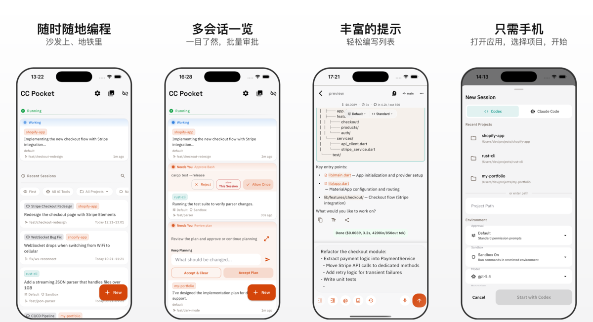

# CC Pocket

CC Pocket 是一款可以让你只用手机就启动并完成 Claude Code / Codex 会话的应用。不需要打开笔记本电脑，只要打开 App、选择项目，就能随时随地开始编码。

[English README](README.md) | [日本語 README](README.ja.md)

<p align="center">
  
</p>

CC Pocket 与 Anthropic 或 OpenAI 没有任何关联，也未获得其认可、赞助或官方合作。

## 为什么做 CC Pocket？

AI 编程代理已经越来越接近能够自主完成整个功能开发。开发者的角色，也从“亲手写代码”逐渐转向“做判断” 例如批准工具调用、回答问题、审查 diff。

做判断不需要键盘，只需要一块屏幕和一根手指。

CC Pocket 就是围绕这种工作方式设计的：你在手机上发起会话，让自己机器上的 Claude Code / Codex 在后台执行，而你无论身在何处，都可以只做关键决策。

## 适合谁用

CC Pocket 面向已经在日常工作中依赖编程代理、并希望离开电脑时也能持续跟进会话的人。

- **运行长时间代理会话的独立开发者**，例如使用 Mac mini、Raspberry Pi、Linux 服务器或笔记本
- **希望在通勤、散步、外出时也能继续交付的独立开发者和创业者**
- **同时管理多个会话、频繁处理审批请求的 AI Native 工程师**
- **希望代码始终留在自己机器上，而不是托管在云 IDE 中的自托管用户**

如果你的工作方式是“启动一个代理，让它跑起来，只在必要时介入”，那 CC Pocket 就是为你准备的。

## 它的价值在哪里

- **在手机上发起或恢复会话**，只要你的 Bridge Server 可以连通
- **用触屏优先的 UI 快速处理审批**，而不是盯着终端提示
- **实时查看流式输出**，包括计划、工具活动和代理回复
- **更轻松地查看 diff**，支持语法高亮和图片差异预览
- **写出更好的提示词**，支持 Markdown、自动补全列表和图片附件
- **跟踪多个会话**，支持按项目分组、搜索和审批徽标
- **在需要你操作时收到推送通知**，例如审批请求或任务完成
- **使用你喜欢的连接方式**，包括已保存机器、二维码、mDNS 自动发现或手动输入 URL
- **通过 SSH 管理远程主机**，完成启动、停止和更新流程

## CC Pocket 和 Remote Control 的区别

Claude Code 自带的 Remote Control 会把一个已经在 Mac 上启动的终端会话交接到手机上 也就是你先在桌面端开始，再从移动端继续。

CC Pocket 走的是另一条路：**会话从手机发起，并在手机上完成整个流程。** 你的 Mac 在后台工作，而手机才是主界面。

| | Remote Control | CC Pocket |
|---|---------------|-----------|
| 会话起点 | 先在 Mac 上开始，再交接给手机 | 直接从手机开始 |
| 主要设备 | Mac（手机后续加入） | 手机（Mac 在后台执行） |
| 典型场景 | 把桌面任务带到路上继续 | 随时随地直接开始编码 |
| 配置方式 | Claude Code 内置 | 自托管 Bridge Server |

**实际意味着：**
- 你**可以**从手机直接启动一个全新的会话，并完整跑完
- 你**可以**重新打开保存在 Mac 上的历史会话
- 你**不能**接入一个已经直接在 Mac 上启动的实时会话

## 快速开始

<p align="center">
  
</p>

### 1. 启动 Bridge Server

在你的主机上安装 [Node.js](https://nodejs.org/) 18+，以及至少一个 CLI 提供方（[Claude Code](https://docs.anthropic.com/en/docs/claude-code) 或 [Codex](https://github.com/openai/codex)），然后运行：

```bash
npx @ccpocket/bridge@latest
```

服务启动后会在终端中打印一个二维码，你可以直接在 App 里扫描并快速连接。

> Warning
> `@ccpocket/bridge` `1.25.0` 之前的版本因潜在的 Anthropic 政策问题（基于 OAuth 的使用方式）已不建议新安装使用。
> 请使用 `>=1.25.0` 版本，并配置 `ANTHROPIC_API_KEY` 替代 OAuth。
>
> **重要提示：** 请通过 `ANTHROPIC_API_KEY` 环境变量设置 API 密钥，而不要通过 Claude CLI 中的 `/login` 设置。通过 `/login` 设置的密钥无法与订阅计划的凭证区分开来，可能会导致问题。

### 2. 安装移动端 App

扫描上方横幅中的二维码，或者直接从应用商店下载：

<div align="center">
<a href="https://apps.apple.com/us/app/cc-pocket-code-anywhere/id6759188790"></a>&nbsp;&nbsp;&nbsp;&nbsp;&nbsp;<a href="https://play.google.com/store/apps/details?id=com.k9i.ccpocket"></a>
</div>

### macOS 桌面版（Beta）

我们也提供了原生的 macOS 应用。它最初只是一个实验，因为有些用户非常喜欢移动端优先的 UI，于是希望在 Mac 上也能获得同样的体验。

它目前仍然是 Beta，但已经可以正常使用。你可以从 [GitHub Releases](https://github.com/K9i-0/ccpocket/releases?q=macos) 下载最新的 `.dmg`（查找带有 `macos/v*` 标签的发行版）。

### 3. 连接并开始编码

| 连接方式 | 最适合的场景 |
|----------|--------------|
| **二维码** | 首次配置最快速，直接扫描终端里的 QR |
| **已保存机器** | 日常使用、重连和状态检查 |
| **mDNS 自动发现** | 同一局域网中免输 IP |
| **手动输入** | Tailscale、远程主机或自定义端口 |

在 App 中选择项目和 AI 工具，然后配置会话模式并启动。

**Claude Code** 使用单一的 **Permission Mode** 来控制审批范围和规划：

| Permission Mode | 行为 |
|----------------|------|
| `Default` | 标准交互模式 |
| `Accept Edits` | 自动批准文件编辑，其他操作仍需确认 |
| `Plan` | 先制定计划，等你批准后再执行 |
| `Bypass All` | 自动批准所有操作 |

**Codex** 将关注点分离为独立的设置：

| 设置 | 选项 | 说明 |
|------|------|------|
| **Execution** | `Default` / `Full Access` | 控制哪些操作需要审批 |
| **Plan** | 开 / 关 | 独立于 Execution 模式切换规划模式 |
| **Sandbox** | 开（默认）/ 关 | 在受限环境中运行，确保安全 |

> Codex 默认开启 Sandbox（偏向安全）。Claude Code 默认关闭 Sandbox。

你也可以启用 **Worktree**，把每个会话隔离到独立的 git worktree 中。

## Worktree 配置（`.gtrconfig`）

在启动会话时启用 **Worktree** 后，应用会自动创建一个带独立分支和目录的 [git worktree](https://git-scm.com/docs/git-worktree)。这样你就可以在同一个项目上并行运行多个会话，而不会互相冲突。

你可以在项目根目录放置一个 [`.gtrconfig`](https://github.com/coderabbitai/git-worktree-runner?tab=readme-ov-file#team-configuration-gtrconfig) 文件，配置文件复制规则和生命周期钩子：

| 区块 | 键 | 说明 |
|------|----|------|
| `[copy]` | `include` | 需要复制的文件 glob，例如 `.env` 或配置文件 |
| `[copy]` | `exclude` | 从复制中排除的 glob 模式 |
| `[copy]` | `includeDirs` | 需要递归复制的目录名 |
| `[copy]` | `excludeDirs` | 需要排除的目录名 |
| `[hook]` | `postCreate` | worktree 创建后执行的 shell 命令 |
| `[hook]` | `preRemove` | worktree 删除前执行的 shell 命令 |

**提示：** 特别推荐把 `.claude/settings.local.json` 加进 `include`。这样每个 worktree 会话都能自动继承你的 MCP 服务器配置和权限设置。

<details>
<summary><code>.gtrconfig</code> 示例</summary>

```ini
[copy]
# Claude Code 设置（MCP 服务器、权限、额外目录）
include = .claude/settings.local.json

# 复制 node_modules，加快 worktree 初始化
includeDirs = node_modules

[hook]
# 创建 worktree 后恢复 Flutter 依赖
postCreate = cd apps/mobile && flutter pub get
```

</details>

## Sandbox 配置（Claude Code）

当你在 App 中启用 sandbox mode 时，Claude Code 会使用它原生的 `.claude/settings.json`（或 `.claude/settings.local.json`）来读取更细粒度的 sandbox 配置。Bridge 端不需要单独配置。

完整的 `sandbox` schema 请参考 [Claude Code 文档](https://docs.anthropic.com/en/docs/claude-code)。

## 理想使用场景

- **一台常驻在线的主机**（Mac mini、Raspberry Pi、Linux 服务器）运行代理，而你用手机远程盯进度
- **一种轻量的移动审查循环**，代理负责写代码，而你只在需要时批准命令或回答问题
- **跨多个项目并行运行多个会话**，所有待审批项都集中在一个移动端收件箱里
- **通过 Tailscale 连接你自己的远程基础设施**，而不是把端口直接暴露到公网

## 远程访问与机器管理

### Tailscale

如果你要在家庭或办公室网络之外访问 Bridge Server，最简单的方式就是 Tailscale。

1. 在主机和手机上都安装 [Tailscale](https://tailscale.com/)
2. 加入同一个 tailnet
3. 在 App 中连接 `ws://<host-tailscale-ip>:8765`

### 已保存机器与 SSH

你可以在 App 中登记机器信息，包括 host、port、API key，以及可选的 SSH 凭据。

启用 SSH 后，CC Pocket 可以直接在机器卡片上触发这些远程操作：

- `Start`
- `Stop Server`
- `Update Bridge`

这个流程支持 **macOS（launchd）** 和 **Linux（systemd）** 主机。

### 服务化设置

`setup` 命令会自动识别你的操作系统，并把 Bridge Server 注册成一个受管理的后台服务。

```bash
npx @ccpocket/bridge@latest setup
npx @ccpocket/bridge@latest setup --port 9000 --api-key YOUR_KEY
npx @ccpocket/bridge@latest setup --uninstall

# 全局安装后的写法
ccpocket-bridge setup
```

#### macOS（launchd）

在 macOS 上，`setup` 会创建 launchd plist，并使用 `launchctl` 注册服务。服务通过 `zsh -li -c` 启动，因此能够继承你的 shell 环境（nvm、pyenv、Homebrew 等）。

#### Linux（systemd）

在 Linux 上，`setup` 会创建 systemd user service。它会在 setup 阶段解析 `npx` 的完整路径，从而确保 nvm、mise、volta 管理的 Node.js 也能在 systemd 下正常工作。

> **提示：** 运行 `loginctl enable-linger $USER` 后，服务会在你退出登录后继续运行。

## 平台说明

- **Bridge Server**：只要 Node.js 和对应的 CLI 提供方能运行，就可以使用
- **服务化设置**：支持 macOS（launchd）和 Linux（systemd）
- **通过 App 使用 SSH 执行 start/stop/update**：要求主机是 macOS（launchd）或 Linux（systemd）
- **窗口列表和截图能力**：仅支持 macOS 主机
- **Tailscale**：不是必须，但强烈推荐用于远程访问

如果你想搭一个整洁、稳定、长期在线的环境，目前最适合的主机依然是 Mac mini 或无头 Linux 机器。

## 截图功能所需的主机配置

如果你要在 macOS 上使用截图功能，请为运行 Bridge Server 的终端应用授予 **屏幕录制** 权限。

否则，`screencapture` 可能会返回全黑的图片。

路径：

`系统设置 -> 隐私与安全性 -> 屏幕录制`

如果你的主机是长期在线的，为了让窗口截图更稳定，也建议关闭显示器休眠和自动锁屏。

```bash
sudo pmset -a displaysleep 0 sleep 0
```

## 开发

### 仓库结构

```text
ccpocket/
├── packages/bridge/    # Bridge Server (TypeScript, WebSocket)
├── apps/mobile/        # Flutter mobile app
└── package.json        # npm workspaces root
```

### 从源码构建

```bash
git clone https://github.com/K9i-0/ccpocket.git
cd ccpocket
npm install
cd apps/mobile && flutter pub get && cd ../..
```

### 常用命令

| 命令 | 说明 |
|------|------|
| `npm run bridge` | 以开发模式启动 Bridge Server |
| `npm run bridge:build` | 构建 Bridge Server |
| `npm run dev` | 重启 Bridge 并启动 Flutter 应用 |
| `npm run dev -- <device-id>` | 与上面相同，但指定设备 |
| `npm run setup` | 将 Bridge Server 注册为后台服务（launchd/systemd） |
| `npm run test:bridge` | 运行 Bridge Server 测试 |
| `cd apps/mobile && flutter test` | 运行 Flutter 测试 |
| `cd apps/mobile && dart analyze` | 运行 Dart 静态分析 |

### 环境变量

| 变量 | 默认值 | 说明 |
|------|--------|------|
| `BRIDGE_PORT` | `8765` | WebSocket 端口 |
| `BRIDGE_HOST` | `0.0.0.0` | 绑定地址 |
| `BRIDGE_API_KEY` | 未设置 | 启用 API key 认证 |
| `BRIDGE_ALLOWED_DIRS` | `$HOME` | 允许访问的项目目录，逗号分隔 |
| `DIFF_IMAGE_AUTO_DISPLAY_KB` | `1024` | 图片 diff 自动显示阈值 |
| `DIFF_IMAGE_MAX_SIZE_MB` | `5` | diff 图片预览允许的最大大小 |

## 许可证

[FSL-1.1-MIT](LICENSE) — 源码可用，并将于 2028-03-17 自动转换为 MIT。
